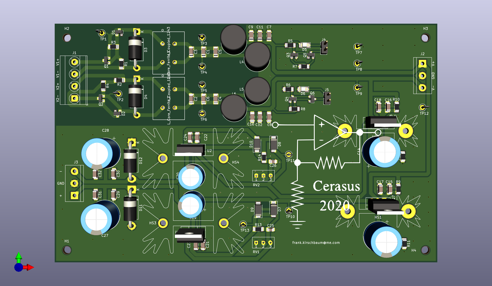
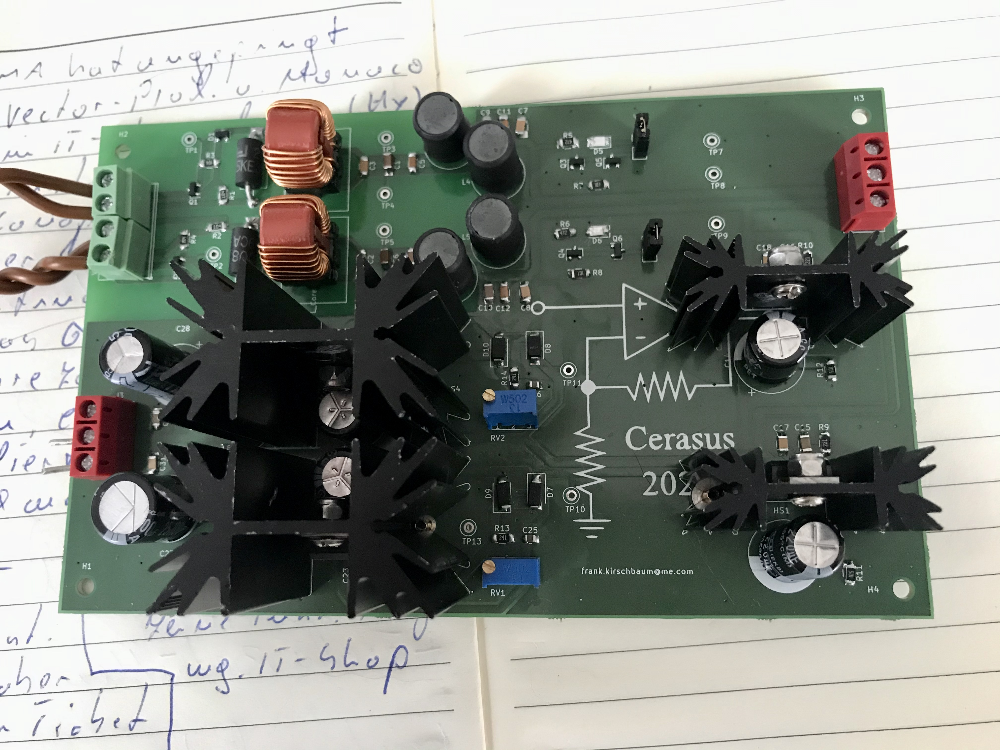

# power_current_source_load

power current source and load

A KiCad project.

The project consists of three PCBs: A general purpose power supply PCB, the control/supervise PCB and the main power PCB.

The power supply PCB gives a clean and stable +/- 15 V output voltage from a 'dirty' switching-mode power supply at its input. In detail it has the functions:
- inverse-polarity protection
- common mode disturbance filtering 
- low pass filtering with fg approx. 3 kHz (Pi-filter)
- low pass filtering with fg approx. 1.5 Hz (RC-Filter with capacitance multiplier)
- Voltage control of +/- 15 V, I_max approx. 1.5 A

